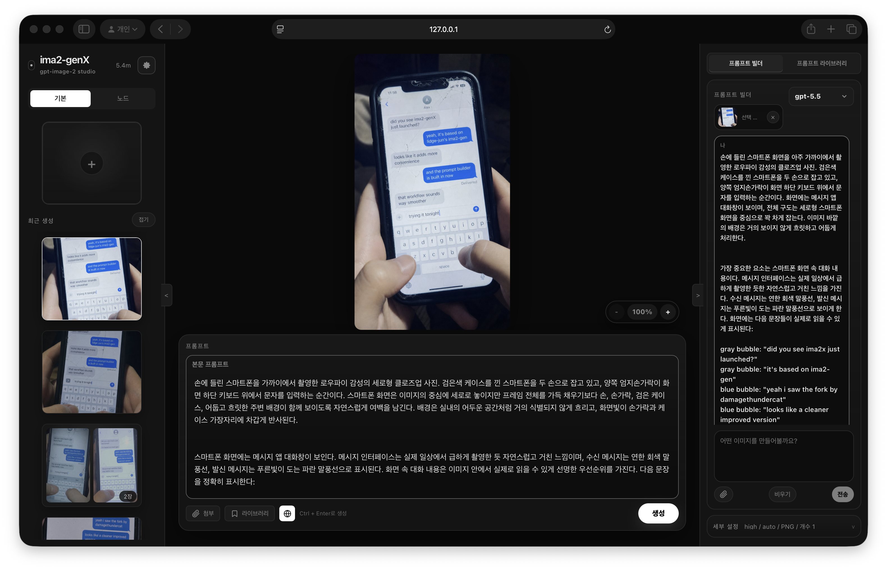
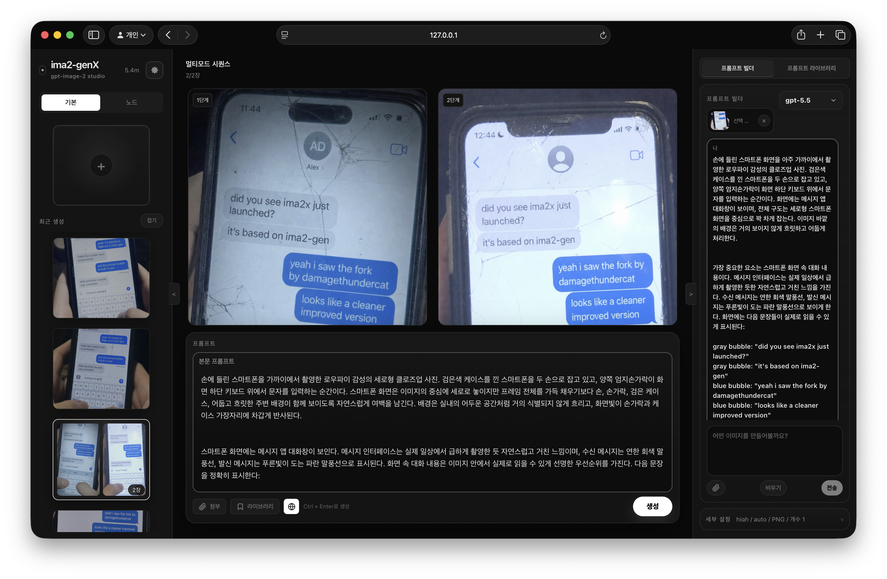
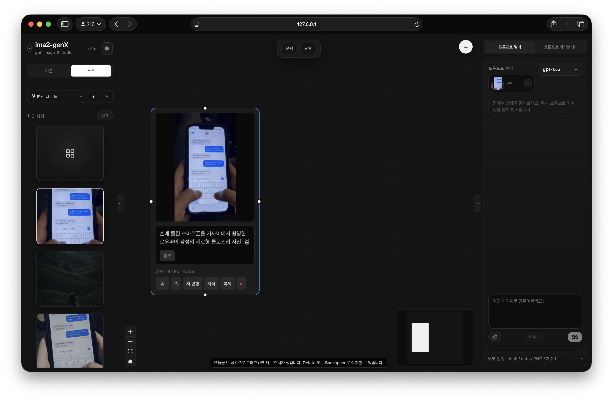
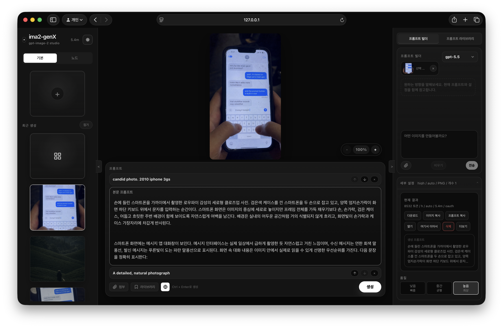

# ima2-genX

<p align="center">
  
</p>

[](https://www.npmjs.com/package/%40damagethundercat%2Fima2-gen)
[](https://nodejs.org/)
[](LICENSE)

<p align="center">
  <a href="assets/screenshots/tutorial1-readme.mp4">
    
  </a>
  <br>
  <a href="assets/screenshots/tutorial1-readme.mp4"><strong>Watch the 43-second tutorial walkthrough</strong></a>
</p>

`ima2-genX` is a local image generation studio for people who want a faster, more controllable ChatGPT/Codex image workflow in a desktop-like web app.

> **Fork note**
> `ima2-genX` is a respectful continuation and heavily modified fork of [`lidge-jun/ima2-gen`](https://github.com/lidge-jun/ima2-gen). It inherits the local OAuth image-generation foundation, but the product surface, prompt workflow, gallery behavior, multimode flow, Node mode, provider handling, CLI coverage, packaging path, and ongoing Canvas Mode work have changed substantially.
>
> The product name is `ima2-genX`. The npm package remains `@damagethundercat/ima2-gen` and the CLI command remains `ima2x` for install continuity and to avoid overwriting the upstream `ima2` command. The app also keeps the default `~/.ima2` data/config folder and default local ports for compatibility. Running the upstream server and this fork at the same time is not recommended because their server/OAuth ports and local runtime advertisement file can collide.

Run it with `npx`, sign in with Codex OAuth, start from a rough prompt, refine it with the built-in Prompt Builder, and keep iterating through history, references, node branches, multimode batches, and the evolving Canvas Mode cleanup tools. No OpenAI API key is required for the default path, but API-key generation is also supported when configured.



## Quick Start

```bash
npx @damagethundercat/ima2-gen serve
```

The web UI opens automatically when the server is ready. If you are running in
a headless terminal or want to open it manually, use `--no-open` and visit the
printed URL.

If Codex is not logged in yet:

```bash
npx @openai/codex login
npx @damagethundercat/ima2-gen serve
```

If `3333` is already occupied, `ima2-genX` binds the next available port and writes the actual URL to `~/.ima2/server.json`. Use `ima2x open` or the URL printed in the terminal instead of assuming the port.

You can also install it globally:

```bash
npm install -g @damagethundercat/ima2-gen
ima2x serve
```

Before updating a global install on Windows, stop any running `ima2x serve`
process. If npm reports `EBUSY` or `resource busy or locked`, close ima2x
terminals, end stale `node.exe` processes if needed, and retry. If the lock
persists, reboot and run the update before starting ima2x again.

## What It Does

- **Prompt Builder first**: turn rough ideas into stronger prompts in the right-side builder, keep image-scoped builder sessions, and carry context across follow-up generations.
- **ima2-genX UI**: large bottom prompt composer, grouped multimode history, improved image viewer controls, refreshed Node-mode side panels, and compact mobile flows.
- **Classic mode**: generate, edit, reuse the current image, paste references, and continue from history.
- **Node mode**: branch a good image into multiple directions without losing the original.
- **Multimode batches**: launch several Classic outputs from one prompt, watch slot-by-slot progress, and continue from the best result.
- **Canvas Mode, in progress**: current builds include zoom, pan, annotation, eraser, background cleanup, and export tools, but this area is still being actively improved and may change across upcoming releases.
- **Local gallery**: keep generated assets on your machine with session-aware history. By default the gallery shows the current session and an All Images toggle reveals the full history; the default scope is sticky across sessions.
- **Reference images**: drag, drop, paste, and attach up to 5 references; large images are compressed before upload.
- **Prompt library and imports**: search reusable prompt material, import local prompt packs, GitHub folders, and curated GPT-image prompt hints into the built-in prompt library.
- **Observable jobs**: active and recent jobs are tracked with safe logs and request IDs.

## What Changed From Upstream

`ima2-genX` keeps the spirit of the original local OAuth image-generation tool while moving the fork in a more workflow-oriented direction:

- The main generation loop now centers on a bottom composer plus a right-side Prompt Builder, not only a single prompt box.
- History, multimode, prompt-library import, and active-job tracking were expanded so repeated iteration is easier to inspect.
- Node mode has been expanded for branching and comparison. Canvas Mode is included, but its cleanup, annotation, export, and follow-up-reference workflow is still being refined.
- API-key generation is available as a configured provider path alongside the default Codex OAuth path.
- The public command is `ima2x`, and the npm package stays under `@damagethundercat/ima2-gen` so existing installs can update cleanly.

## Provider Paths

Image generation can run through either the local Codex/ChatGPT OAuth path or a configured OpenAI API key.

- `provider: "oauth"` uses the local Codex OAuth proxy.
- `provider: "api"` calls the OpenAI Responses API with the hosted `image_generation` tool.
- API-key generation supports classic generate, edit, mask-guided edit, multimode, and node generation.

If no provider is specified, the app keeps the current OAuth/default behavior. API-key generation defaults to `gpt-5.4-mini`, `low` reasoning, and `1024x1024` unless the request passes validated model, reasoning, size, or web-search options.


## Model Guidance

The app defaults to **`gpt-5.4-mini`** for fast local iteration. Switch to **`gpt-5.4`** when you want the safest balanced image workflow.

- `gpt-5.4` — recommended balanced choice.
- `gpt-5.4-mini` — current default and faster draft model.
- `gpt-5.5` — strongest quality option when your Codex CLI/OAuth backend supports it. It may use more quota, expose different tool capabilities, or require updating Codex CLI before it works reliably.

The app also exposes quality (`low`, `medium`, `high`) and moderation (`auto`, `low`) controls.

## Workflows

### Prompt Builder To Image

Use the Prompt Builder when you have an idea but want a cleaner generation prompt before spending a request.

1. Write a rough idea in the composer.
2. Use the Prompt Builder to clarify subject, composition, style, constraints, and follow-up intent.
3. Attach references or reuse the current image when the next step should preserve visual continuity.
4. Generate one image, or enable multimode to fan out several candidate slots from the same refined prompt.
5. Continue from the strongest result, branch it in Node mode, or try the current Canvas Mode cleanup tools.



### Classic Mode

Use Classic when you want one strong result quickly, with or without the builder. You can generate, edit, paste references, reuse the current image, and continue from any item in local history.

### Node Mode

Use Node mode when you want to explore branches.



Each node keeps its own prompt and result. Root nodes can attach local references; child nodes use the parent image as their source. Completed jobs are matched back to nodes by request ID, so reloads and graph version conflicts can recover finished results.

### Canvas Mode

Canvas Mode is included, but in `ima2-genX` it is still under active improvement. Use the current version for light cleanup, annotation, and export checks, and expect this workflow to receive more UI and behavior updates in upcoming releases.

- Current builds focus on viewport zoom/pan, annotation, eraser, sticky notes, background-cleanup previews, and alpha or matte-backed export.
- The pan/zoom feel, cleanup flow, saved canvas-version behavior, and follow-up reference workflow are being revised.
- Screenshots in this section will be refreshed once the updated Canvas Mode workflow settles.

<!-- Screenshot refresh: replace after the ima2-genX Canvas Mode capture is ready. -->


### Prompt Builder, Library, And Imports

The Prompt Builder helps turn an intent into a generation-ready prompt, while the prompt library stores reusable prompt material. The library now gives imported prompts a stronger browsing and search surface, and it can be filled from local files, GitHub folders, curated sources, and GPT-image hint packs. Imported prompts are indexed locally so search and ranking work without re-importing the same source every session.



### Experimental Card News Mode

Card News is still dev-only and experimental. It is hidden in the default
published runtime unless explicitly enabled for development, and it should not
be treated as a stable public feature yet.

### Settings

The settings workspace keeps account, model, appearance, and language controls away from the generation sidebar.

<!-- Screenshot refresh: replace after the ima2-genX settings capture is ready. -->


## CLI Commands

### Server

| Command | Description |
|---|---|
| `ima2x serve [--dev] [--no-open]` | Start the local web server and open the web UI; `--dev` enables verbose server diagnostics; `--no-open` keeps the browser closed |
| `ima2x setup` | Reconfigure saved auth |
| `ima2x status` | Show config and OAuth status |
| `ima2x doctor` | Diagnose Node, package, config, and auth |
| `ima2x open` | Open the web UI |
| `ima2x reset` | Remove saved config |

### Client

These require a running `ima2x serve`. The CLI covers every server route. The most common ones are below — the [full CLI reference](docs/CLI.md) lists everything (generation, history, sessions, prompt library, annotations, Card News, observability, config).

| Command | Description |
|---|---|
| `ima2x gen <prompt>` | Generate from the CLI |
| `ima2x edit <file> --prompt <text>` | Edit an existing image |
| `ima2x multimode <prompt>` | Multi-image SSE generation |
| `ima2x ls [--session <id>] [--favorites]` | List recent history |
| `ima2x show <name> [--metadata]` | Reveal a generated asset |
| `ima2x prompt ls -q <search>` | Search the prompt library |
| `ima2x inflight ls [--terminal]` | List active and recent jobs (alias of `ps`) |
| `ima2x config set <key> <value>` | Write to `~/.ima2/config.json` |
| `ima2x ping` | Health-check the running server |

The server advertises its actual port at `~/.ima2/server.json`. If `3333` is busy, the backend falls back to `3334+` and CLI commands follow the advertised URL. Override discovery with `--server <url>` or `IMA2_SERVER=http://localhost:3333`.

```bash
ima2x gen "poster" --model gpt-5.4 --reasoning-effort high
ima2x edit input.png --prompt "make it rainy" --web-search
ima2x multimode "two cats playing" -n 2
ima2x inflight ls --terminal
ima2x config set imageModels.reasoningEffort high
```

Full reference: [docs/CLI.md](docs/CLI.md).

## Configuration

Config priority:

```text
environment variables > ~/.ima2/config.json > built-in defaults
```

| Variable | Default | Description |
|---|---:|---|
| `IMA2_PORT` / `PORT` | `3333` | Web server port |
| `IMA2_HOST` | `127.0.0.1` | Web server bind host |
| `IMA2_OAUTH_PROXY_PORT` / `OAUTH_PORT` | `10531` | OAuth proxy port |
| `IMA2_SERVER` | — | CLI target override |
| `IMA2_CONFIG_DIR` | `~/.ima2` | Config and SQLite location |
| `IMA2_ADVERTISE_FILE` | `~/.ima2/server.json` | Runtime discovery file |
| `IMA2_GENERATED_DIR` | `~/.ima2/generated` | Generated image directory |
| `IMA2_IMAGE_MODEL_DEFAULT` | `gpt-5.4-mini` | Server fallback image model |
| `IMA2_NO_OAUTH_PROXY` | — | Set `1` to disable the auto-started OAuth proxy |
| `IMA2_LOG_LEVEL` | `warn` | Normal serve defaults to `warn`; dev mode defaults to `debug`; supports `debug`, `info`, `warn`, `error`, or `silent` |
| `IMA2_INFLIGHT_TERMINAL_TTL_MS` | `30000` | Recent terminal job retention for debug views |
| `OPENAI_API_KEY` | — | API key for the `provider: "api"` Responses API image path and auxiliary API-key features |
| `IMA2_API_IMAGE_MODEL_DEFAULT` | `gpt-5.4-mini` | Default image model for `provider: "api"` |
| `IMA2_API_REASONING_EFFORT` | `low` | Default reasoning effort for `provider: "api"` |
| `IMA2_API_IMAGE_SIZE` | `1024x1024` | Default size for `provider: "api"` |
| `IMA2_API_ALLOW_WEB_SEARCH` | `true` | Toggle web search for `provider: "api"` |
| `IMA2_OAUTH_MASKED_EDIT_ENABLED` | `false` | Opt-in feature flag for masked-edit requests on the OAuth path (#31, groundwork only) |

### Logging modes

`ima2x serve` keeps terminal output intentionally quiet: startup URLs, warnings, and errors stay visible, while request/node/OAuth structured logs are hidden by default.

Use `ima2x serve --dev`, `npm run dev`, or `IMA2_LOG_LEVEL=debug ima2x serve` when you need request IDs, node generation phases, OAuth stream diagnostics, or inflight state transitions. Explicit `IMA2_LOG_LEVEL` and `~/.ima2/config.json` values still override the built-in defaults.

## API Reference

The endpoint list moved to [docs/API.md](docs/API.md) so this README can stay focused on first-run use.

Useful references:

- [CLI Reference](docs/CLI.md)
- [API Reference](docs/API.md)
- [FAQ](docs/FAQ.md)
- [Recover old images](docs/RECOVER_OLD_IMAGES.md)

Translated README files may lag behind the current `ima2-genX` release:

- [Korean README](docs/README.ko.md)
- [Japanese README](docs/README.ja.md)
- [Chinese README](docs/README.zh-CN.md)

## Troubleshooting

**`ima2x ping` says the server is unreachable**
Start `ima2x serve`, then check `~/.ima2/server.json`. You can also run `ima2x ping --server http://localhost:3333`.

**OAuth login does not work**
Run `npx @openai/codex login`, confirm `ima2x status`, then restart `ima2x serve`.

**`fetch failed` repeats on a proxy/VPN network**
Check that the local OAuth proxy is reachable. On networks that require a proxy, enable your proxy client's TUN/TURN-style mode, then retry `npx openai-oauth --port 10531`. If it still fails, set `HTTP_PROXY` and `HTTPS_PROXY` in the same terminal that runs `ima2x serve` or `openai-oauth`.

**Images fail with `API_KEY_REQUIRED`**
Set `OPENAI_API_KEY` or configure an API key before using `provider: "api"`. The default OAuth path still works without an API key.

**A large reference image fails**
The app compresses large JPEG/PNG references before upload. If a file still fails, convert it to JPEG or PNG at a lower resolution and try again. HEIC/HEIF files are not supported by the browser path.

**Old gallery images are missing after updating**
Recent versions moved generated images from the installed package folder to `~/.ima2/generated`. Run `ima2x doctor` and see [Recover old images](docs/RECOVER_OLD_IMAGES.md).

**`gpt-5.5` fails but other models work**
Update Codex CLI first, then retry. If it still fails, your account or backend route may not expose the same image capability or quota for `gpt-5.5` yet; use `gpt-5.4` as the stable fallback.

**The app opened on a different port**
If the requested server port is busy, `ima2-genX` falls back to the next available port and records it in `~/.ima2/server.json`. If the port is unexpectedly `3457`, your shell may also have inherited `PORT=3457` from another local tool. Run `unset PORT` or start with `IMA2_PORT=3333 ima2x serve`.

**Port `10531` is already used on Windows**
Some Windows security tools, including `AnySign4PC.exe`, may occupy the default OAuth proxy port. Current builds track the actual fallback OAuth port. If you still need a manual override, start with `IMA2_OAUTH_PROXY_PORT=11531 ima2x serve` and check `ima2x doctor`.

For more beginner-friendly answers, see the [FAQ](docs/FAQ.md).

## Development

```bash
git clone https://github.com/damagethundercat/ima2-gen.git
cd ima2-gen
npm install
npm run dev
npm run typecheck
npm test
npm run build
```

`npm run dev` builds the UI and starts the TypeScript server entry with `--watch` and verbose server diagnostics. `npm run typecheck`, `npm run build:server`, and `npm run build:cli` verify the TypeScript migration and package emit path. Node mode is part of the packaged UI by default; Canvas Mode is included but still actively being improved.

### Release

Manual npm publish:

```bash
npm login
npm run prepublishOnly
npm publish --access public
```

For later releases, bump the version, push a `v*` tag, and let `.github/workflows/publish.yml` publish with the repo secret `NPM_TOKEN`:

```bash
npm version patch
git push origin main --tags
```

## License

MIT
